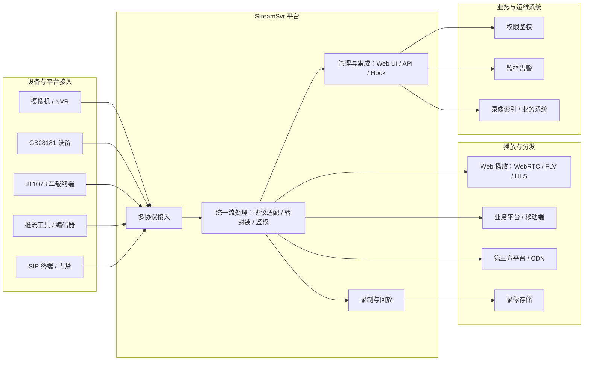

# StreamSvr 产品介绍

## 产品定位

**StreamSvr** 是一款基于 **Go** 语言开发的企业级流媒体服务引擎，面向 **直播、安防监控、车载视频、Web 低延迟播放、SIP 音视频接入** 等场景，提供 **多协议接入、协议互通（转封装）、分发、录制回放与运维管控** 的一体化能力。

产品强调 **高并发、低延迟、协议栈完整、易集成与可运维**，适合作为企业媒体接入层、协议网关与统一流分发中心。基于 **Go 技术栈** 与 **单二进制部署** 方式，可更方便地落地在私有化、边缘节点与容器化环境中。

| 维度 | StreamSvr |
|------|-----------|
| 技术栈 | Go，单二进制部署，跨平台构建 |
| 核心能力 | 多协议接入、转封装分发、录制回放、运维管控 |
| 典型场景 | 安防监控、车载视频、Web 低延迟播放、SIP 音视频网关、多协议统一分发 |
| 管控方式 | 内置 Web UI、HTTP API、HTTP 通知 Hook、可选 Prometheus 指标 |

---

## 选择 StreamSvr

### 1. 协议覆盖广，一套服务打通多终端

同一路实时流可同时面向 **摄像机/NVR、浏览器、移动端、CDN、国标平台、SIP 话机** 输出，减少多套中间件串联带来的延迟与运维成本。

### 2. 转封装而非重编码，延迟与资源占用更可控

在编码格式已匹配的前提下，通过 **容器/协议层转换**（如 RTMP → HTTP-FLV、RTSP → WebRTC）完成分发，**默认不做 H.264/H.265 重编码**，有利于降低 CPU 占用、缩短端到端时延。部分场景提供 **按需音频转码**（如 WHEP 侧 AAC→Opus）。

### 3. 监控与行业协议开箱可用

除通用直播协议外，内置 **GB28181、JT1078、ONVIF、VoIP/SIP** 等模块（按配置启用），适合 **安防、交通车载、设备发现与云台控制、语音对讲** 类项目。

### 4. 现代 Web 播放栈

支持 **WebRTC**、**HTTP-FLV / HTTP-fMP4**、**HLS / LL-HLS**、**DASH** 等常用 Web 播放方式，兼顾低延迟预览、标准化接入与大规模分发。

### 5. 可管理、可集成

- 内置 **Web 管理界面**，便于查看服务状态与流信息  
- 提供 **HTTP API**，支持流控制、会话管理与配置更新  
- 支持 **HTTP 通知 Hook**，便于与鉴权、计费、录像索引等业务系统联动  

### 6. 易于部署与交付

- 配置结构清晰，适合私有化部署与日常运维管理  
- 支持通过 API、事件通知与现有业务系统对接  
- 适合部署在中心机房、边缘节点或容器环境

---

## 核心能力一览

### 协议接入与分发

| 类别 | 支持能力 | 说明 |
|------|----------|------|
| **RTMP** | 推流 / 拉流 | 适合直播推流与互联网分发 |
| **RTSP** | 推流 / 拉流 / 组播 | 适合摄像机、NVR 与安防设备接入 |
| **HTTP 流媒体** | HTTP-FLV、HTTP-TS、HTTP-fMP4 | 适合 Web 页面、业务系统与 CDN 分发 |
| **HLS** | TS-HLS、fMP4-HLS、LL-HLS | 适合浏览器访问与大规模分发 |
| **DASH** | MPEG-DASH、LL-DASH | 适合标准化 Web 分发场景 |
| **WebRTC** | WHIP 推流、WHEP 拉流 | 适合低延迟播放与互动场景 |
| **SRT** | 推流 / 拉流 | 适合弱网、跨公网传输 |
| **GB28181** | 设备注册、实时预览、回放、PTZ、对讲 | 适合国标安防项目 |
| **JT1078** | 车载音视频接入 | 适合车载视频接入场景 |
| **ONVIF** | 发现、取流地址、快照、PTZ | 适合设备发现、取流与控制 |
| **VoIP / SIP** | 软电话、门禁、IP PBX 入站呼叫 | 适合语音视频网关场景 |

> 各协议下的 **音视频编码具体支持范围** 见下文 **[音视频编码与格式支持](#音视频编码与格式支持)**。

### 录制与回放

| 格式 | 用途 |
|------|------|
| FLV | 传统录制、易与现有 FLV 链路对接 |
| MPEG-TS | 监控与广电友好 |
| fMP4 | 现代播放器与 HLS/DASH 生态 |
| MPEG-PS | 部分国标/安防设备习惯格式 |

支持 **按时间滚动切片**；内置 **回放 HTTP 服务**，可对录制目录进行点播浏览（默认路径见配置 `playback` 节点）。

### 运维与安全

- **鉴权控制**：推拉流、API 访问可配置密钥或 Token  
- **会话管理**：支持查看在线流并管理推流/拉流会话  
- **统一管理入口**：通过 Web 界面与 API 进行状态查看、控制与配置更新  
- **业务联动**：通过 HTTP Hook 对接鉴权、计费、录像索引等系统  

---

## 音视频编码与格式支持

本节按 **协议维度** 说明 StreamSvr 对音视频编码的支持情况，便于客户对照摄像机、编码器、播放器与业务终端能力进行方案设计。

> **说明**：StreamSvr 以 **转封装（Remux）** 为主，**不改变视频分辨率/帧率/码率**。如需大规模视频转码、水印或复杂媒体处理，建议外接专用转码服务。

### 主流编码支持

| 编码 | 典型用途 | 主要支持协议 |
|------|----------|--------------|
| **H.264 / AVC** | 监控、直播、Web | RTMP、RTSP、HTTP-FLV/TS/fMP4、HLS、DASH、WebRTC、GB28181、JT1078、SRT、录制 |
| **H.265 / HEVC** | 高清监控、省带宽 | RTSP、HLS、DASH、WebRTC、GB28181、JT1078、SRT、录制 |
| **AAC** | 浏览器与直播主流音频 | RTMP、RTSP、HTTP-FLV/TS/fMP4、HLS、DASH、WebRTC、GB28181、JT1078、录制 |
| **G.711 A-law / μ-law** | 监控对讲、话机音频 | RTSP、WebRTC、GB28181、JT1078、VoIP / SIP |
| **Opus** | WebRTC、SIP 音频 | WebRTC、VoIP / SIP |

---

### RTSP / RTSPS

- 支持实时流接入、转发与拉流，适合摄像机、NVR 和安防设备接入。
- 常见编码：H.264、H.265、AAC、G.711。
- 可分发到 RTMP、HTTP-FLV、HLS、WebRTC 等下游链路。

---

### RTMP / RTMPS

- 适合直播推流与互联网分发场景。
- 可与 HTTP-FLV、HLS、WebRTC 等链路联动输出。
- 主流组合以 H.264 + AAC 为主。

---

### HLS / LL-HLS

- 适合浏览器播放、跨平台访问与大规模分发。
- 支持 TS / fMP4 切片与录制落盘。
- 常见编码：H.264、H.265、AAC。

---

### HTTP-TS / HTTP-fMP4 / DASH

- 适合 Web 页面播放、业务系统集成与 CDN 分发。
- 常见编码：H.264、H.265、AAC。

---

### WebRTC（WHIP / WHEP）

- 适合低延迟预览、实时播放与互动场景。
- 常见编码：H.264、H.265、AAC、Opus、G.711。
- 可与 RTSP、RTMP、HTTP 流媒体链路互通。

---

### SRT

- 适合跨公网、弱网传输与远程回传。
- 常见编码：H.264、H.265、AAC、G.711、Opus。

---

### GB28181

- 适合国标安防项目中的设备接入、实时预览、回放与云台控制。
- 常见编码：H.264、H.265、AAC、G.711。
- 接入后的流可继续分发到 Web、平台或存储系统。

---

### JT1078（车载）

- 适合车载音视频接入与统一转发。
- 常见编码：H.264、H.265、AAC、G.711。
- 可输出到 RTMP、HTTP、WebRTC 等下游链路。

---

### VoIP / SIP

- 适合软电话、门禁、IP PBX 等语音视频网关场景。
- 常见编码：H.264、H.265、AAC、G.711、Opus。
- 可与 Web 播放、录像与业务平台联动。

---

### ONVIF

- 适合设备发现、取流地址获取、快照与云台控制。
- 媒体接入通常配合 RTSP 链路使用，编码能力取决于前端设备。

---

### 录制与回放（文件格式 × 编码）

| 录制容器 | 常见写入编码 | 说明 |
|----------|--------------|------|
| **FLV** | H.264、AAC、G.711 | 监控/直播归档常用 |
| **MPEG-TS** | H.264、H.265、AAC、G.711 | 安防与广电场景常用 |
| **fMP4** | H.264、H.265、AAC | 现代播放器友好 |
| **MPEG-PS** | H.264、H.265、AAC、G.711 | 国标/安防场景常用 |

回放服务按录制目录 HTTP 点播，**不改变** 文件内编码。

---

## 典型应用场景

| 场景 | 方案要点 |
|------|----------|
| **安防视频监控** | 摄像机/ NVR RTSP 或 ONVIF 接入 → 转 HTTP-FLV / HLS / WebRTC 供 Web 与大屏；GB28181 上级平台对接 |
| **交通车载平台** | JT1078 终端接入 → 统一转 RTMP/HTTP/WebRTC；可与 GIS、告警业务 Hook 联动 |
| **直播 / 活动转播** | RTMP/OBS 推流 → 多协议分发（FLV/HLS/WebRTC）；按需开启录制 |
| **低延迟互动** | WHIP/WHEP 接入与播放；适合实时预览与互动场景 |
| **SIP 语音视频网关** | 话机/门禁呼叫接入 → 录像、转发、Web 监看 |
| **多协议中转枢纽** | 单点接入（如 RTSP）→ 多点输出（RTMP、SRT、HLS），减少编码级联 |
| **私有化部署 / 边缘节点** | 单二进制 + 配置化部署，适合私有化交付与边缘节点落地 |

---

## 系统架构（逻辑视图）



**说明**：StreamSvr 位于设备接入层与业务应用层之间，向上承接多来源音视频流，向下统一输出到 Web、第三方平台与录像存储，并通过 API / Hook 与业务系统联动。对客户而言，它更像一个“统一接入 + 统一分发 + 统一管理”的流媒体中枢。

---

## 方案建议

- **统一接入与分发场景**：适合将 RTSP、RTMP、GB28181、JT1078、SIP 等多来源流统一接入，再分发到 Web、平台或业务系统。
- **浏览器低延迟场景**：优先结合 WebRTC（WHEP/WHIP）与内置预览能力，缩短验流与联调周期。
- **复杂媒体处理场景**：如需大规模转码、水印、AI 分析，建议将 StreamSvr 作为接入与分发层，外接 FFmpeg 或 GPU 转码集群。

---

## 快速体验

### 环境要求

- 操作系统：Linux / Windows / macOS（以实际发布包为准）  
- 建议为流媒体服务开放所需端口（RTMP 1935、HTTP 8080、RTSP 5544、WebRTC UDP 4888 等，均以配置为准）

### 启动服务

```bash
# 构建
make

# 启动（Linux 示例）
./bin/linux_amd64/streamsvr -c conf/streamsvr.conf.json
```

Windows：

```powershell
.\bin\windows\streamsvr.exe -c conf\streamsvr.conf.json
```

### 默认已启用能力（摘录）

开箱配置通常已开启：**RTMP、RTSP、HTTP-FLV、HTTP-fMP4、WebRTC、HTTP API、Web UI、ONVIF、本地回放服务**。

需按项目开启的模块示例：**HLS、DASH、SRT、GB28181、VoIP** 等——在 `conf/streamsvr.conf.json` 中将对应 `enable` 设为 `true`。

### 常用访问地址（默认端口示例）

| 用途 | 地址示例 |
|------|----------|
| Web 管理界面 | `http://<服务器IP>:8080/svrui/` |
| RTMP 推/拉流 | `rtmp://<服务器IP>:1935/live/<流名>` |
| RTSP 推/拉流 | `rtsp://<服务器IP>:5544/live/<流名>` |
| HTTP-FLV | `http://<服务器IP>:8080/live/<流名>.flv` |
| HTTP-fMP4 | `http://<服务器IP>:8080/m4s/live/<流名>.mp4` |
| WebRTC WHEP | `http://<服务器IP>:8080/live/<流名>.whep` |
| 浏览器预览 | 在播放地址后加 `?preview=1` |

> 更多 URL 规则与配置说明见项目 [README](../README.md)。

---

## 交付与集成

### 集成方式建议

1. **单机/Media Server 模式**：直接部署 `streamsvr` 二进制，由运维通过 JSON + API 管理。  
2. **业务联动模式**：通过 **HTTP Hook** 接收推流/断流/播放事件，与鉴权、计费、录像索引系统对接。  
3. **平台集成模式**：将 StreamSvr 作为媒体接入与分发能力，接入现有业务平台或行业系统。  

### 能力边界（商务与技术对齐）

请在售前阶段明确以下边界，避免验收争议：

| 项目 | 说明 |
|------|------|
| 转码 | 默认仅 **转封装**；不改变视频分辨率/码率（特殊音频处理除外） |
| 转码需求 | 建议外接 FFmpeg / 硬件转码服务或专用转码集群 |
| 性能指标 | 并发路数、带宽、延迟与服务器配置、网络环境相关，建议按目标业务做专项压测 |
| 高可用 | 可结合负载均衡与主备/集群方案实现高可用部署 |

---

## 版本与许可

- 版本信息：启动时执行 `streamsvr -v` 查看构建信息。  
- 开源协议与版权声明：以仓库根目录 **LICENSE** 为准。  
- 如交付包中包含第三方组件或依赖，请同时遵循其各自许可证说明。


